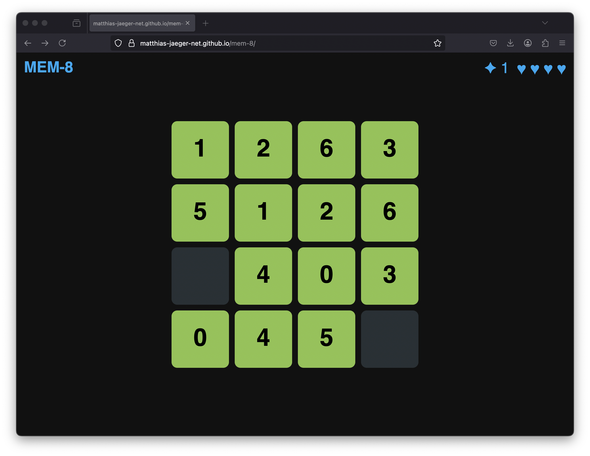

# MEM-8: The Memory Match Challenge

MEM-8 is a dynamic and engaging memory card matching game designed to test your focus, memory, and speed. Flip cards to find matching pairs. You start with 8 lives and aim to match all 8 pairs before running out. Each successful match rewards you with a life, while mismatches cost you one. With sound effects, visual feedback, and rising tension as lives drop, MEM-8 challenges your memory and speed in a fun, replayable format.

Whether you're looking for a casual brain teaser or want to beat your own win streak, MEM-8 offers an addictive challenge that’s easy to play and hard to master.

Sound effects: https://pixabay.com
JavaScript: https://p5js.org/

# [Play MEM-8](https://matthias-jaeger-net.github.io/mem-8/)
